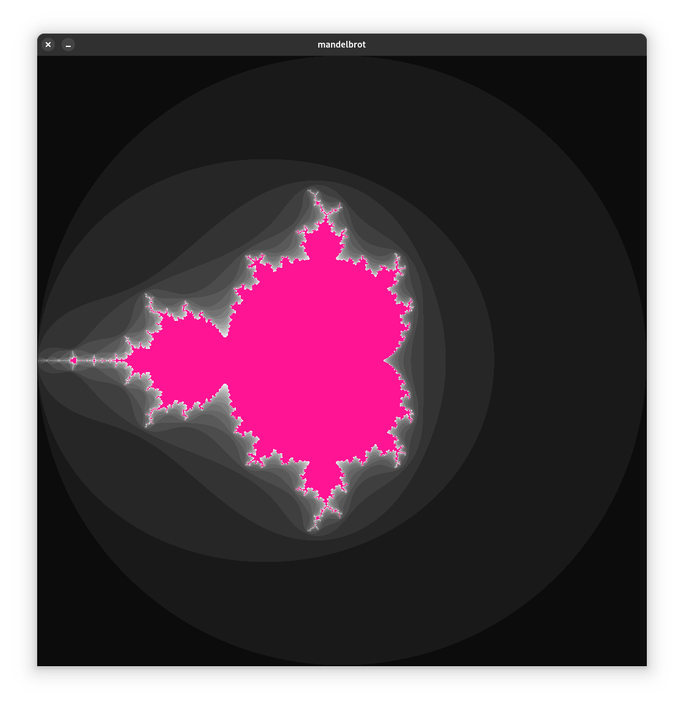

# 🌌 Mandelbrot Set Visualizer (ArKo Project)

This Mandelbrot set visualizer was developed as part of the **ArKo (Architektura Komputerów)** class at the university. It combines high-level C programming and assembly integration to efficiently render fractals using Allegro 5.

---

## 📖 Overview

The Mandelbrot set is a famous fractal characterized by infinite complexity generated from a simple mathematical formula. This project allows interactive exploration and rendering of this fractal using optimized algorithms and assembly code.

---

## 🚀 Features

- **Dynamic Iterations:** Adjust the number of iterations in real-time using arrow keys.
  - ⬅️ **Left Arrow:** Decrease iterations
  - ➡️ **Right Arrow:** Increase iterations
- **Performance Optimization:** Efficient rendering via assembly code.

---

## 🛠️ Dependencies

Make sure these dependencies are installed on your system:

- **GCC** compiler
- **NASM** assembler
- **Allegro 5** graphics library

Fedora Installation

```bash
sudo dnf install gcc nasm allegro5 allegro5-devel
```

Ubuntu/Debian Installation

```bash
sudo apt-get update
sudo apt-get install gcc nasm liballegro5-dev
```

---

## ⚙️ Compilation Instructions

### Step 1: Assemble Assembly File

```bash
nasm -f elf64 mandelbrot.asm -o mandelbrot.o
```

### Step 2: Compile and Link

```bash
gcc main.c mandelbrot.o -o mandelbrot $(pkg-config --cflags --libs allegro-5 allegro_primitives-5 allegro_font-5)
```

### Step 3: Run Program

```bash
./mandelbrot
```

---

## 🎮 Controls

- **Adjust Iterations:** ⬅️ and ➡️ keys

---

## 📸 Example Visualization



---

## 📝 License

Feel free to use, modify, and distribute this project. Attribution is appreciated.

---

🎉 **Enjoy exploring fractals!**
